# Ruta Verde — Arma tu tour por el Quindío

Guía turística **gratuita** del Eje Cafetero (Quindío, Colombia). Eliges los lugares que quieres ver, dónde comer y dónde dormir, y la página arma tu recorrido por días, con horarios, mapa y cómo llegar. Al final te llevas la guía en PDF o la compartes con un enlace.

**Página publicada:** https://dsebas28.github.io/guia-turistico/

**Cómo está hecha por dentro:** [Guía del código](docs/GUIA-DEL-CODIGO.md) — estado del tour, enlace para compartir, reparto en días, horarios, clima, uso sin internet y dos idiomas, con fragmentos del código explicados.

Funciona en español e inglés. El diseño es oscuro y cinematográfico: fotos a pantalla completa, colores del Eje Cafetero (verde, dorado y naranja café) y títulos grandes.

## Capturas

Tomadas de la página publicada el 28 de septiembre de 2026. Están en la carpeta [capturas](capturas/).

### Portada

Al bajar, la palabra QUINDÍO crece y se desvanece, y se abre la foto del Valle del Cocora.

| Al entrar | Al bajar |
|---|---|
| 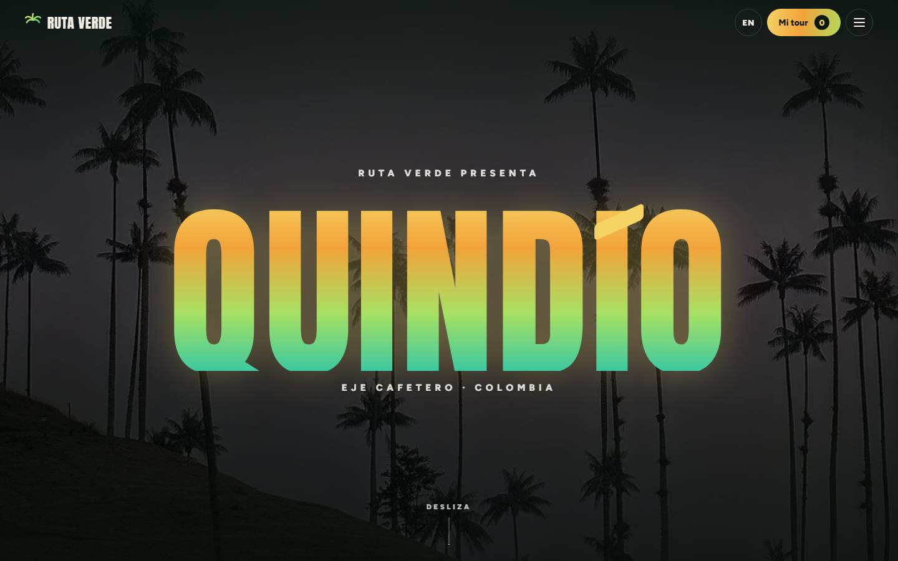 | 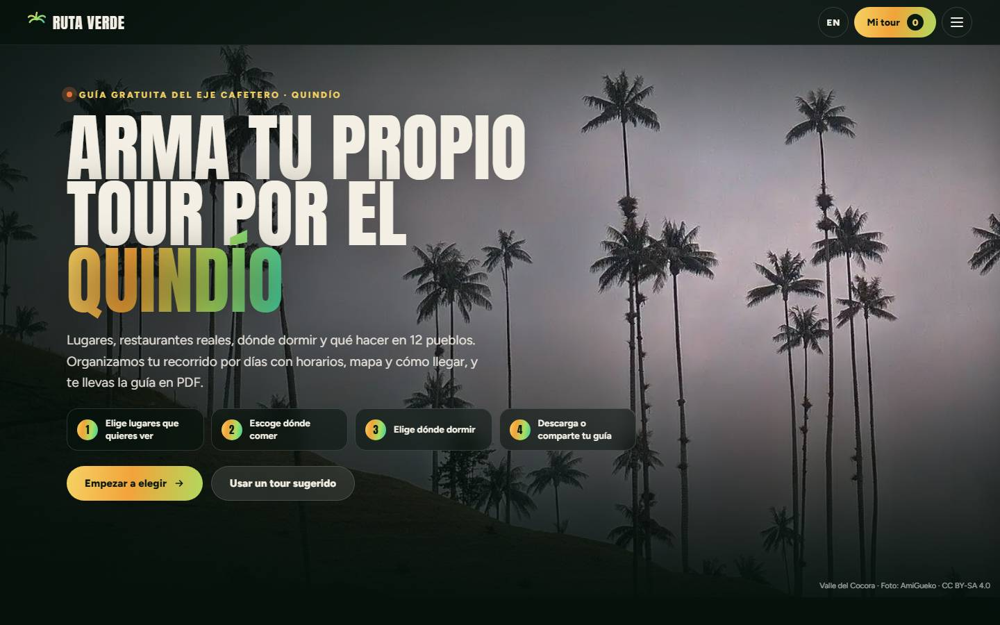 |

### Tours sugeridos y mapa de la región

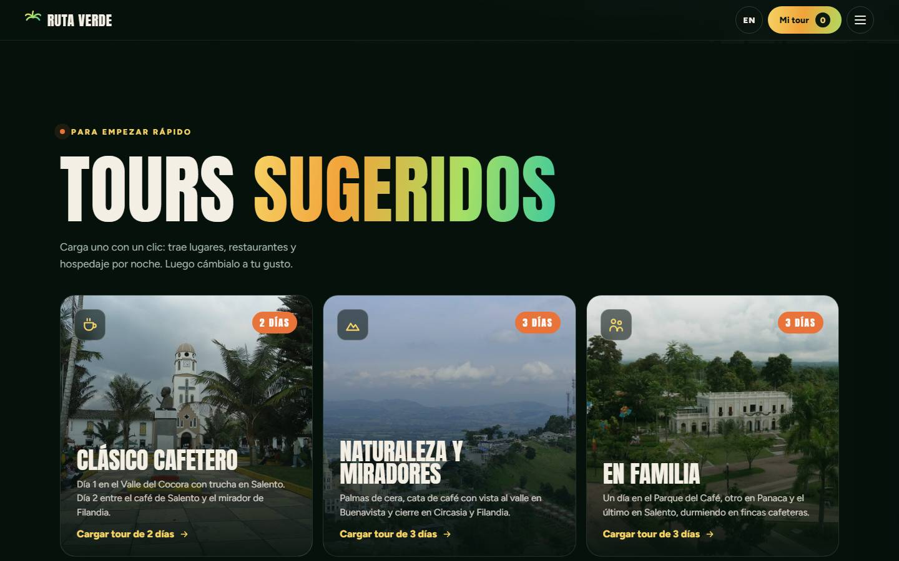

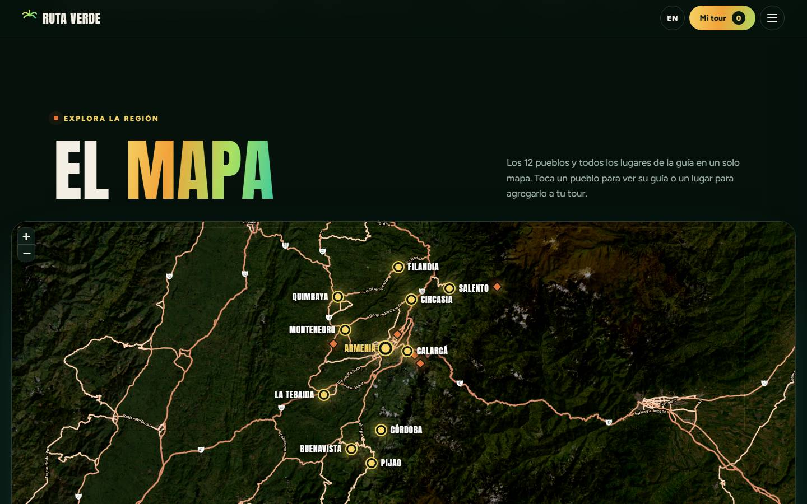

### Lugares, dónde comer y dónde dormir

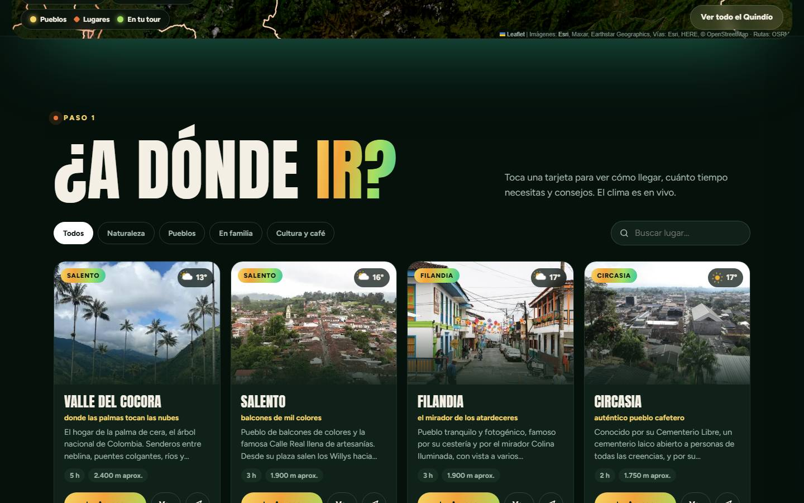

| Dónde comer | Dónde dormir |
|---|---|
| 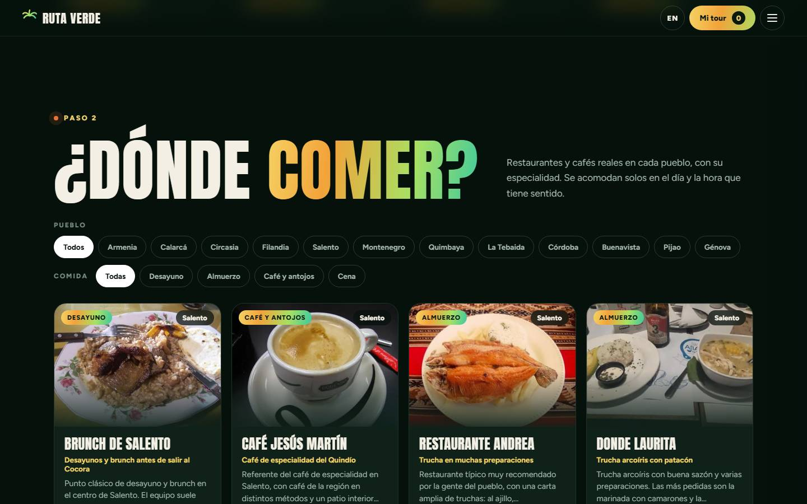 | 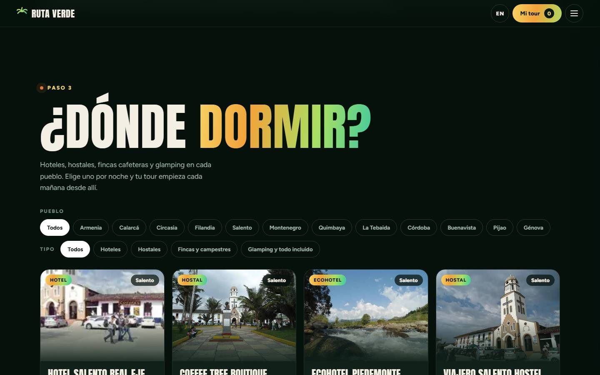 |

### Pueblo por pueblo

| Foto y nombre del pueblo | Qué hacer, dónde comer y dormir |
|---|---|
| 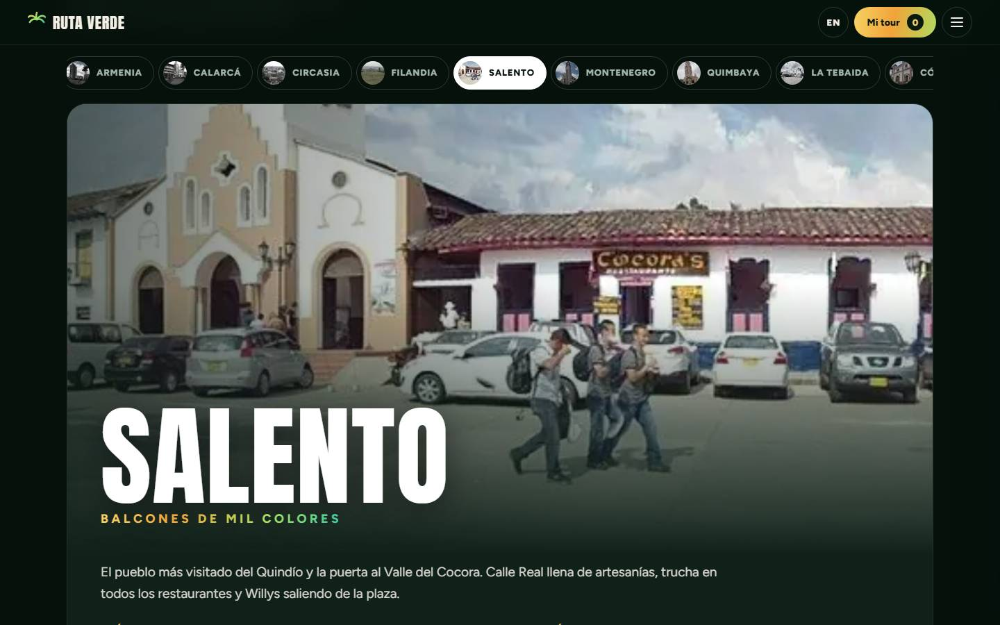 | 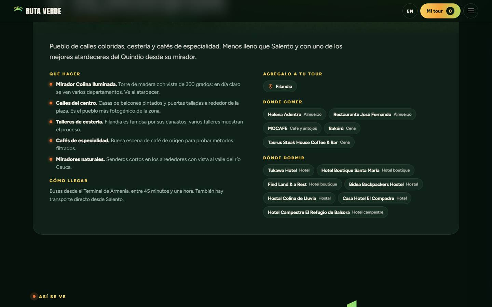 |

### Postales

| | |
|---|---|
| 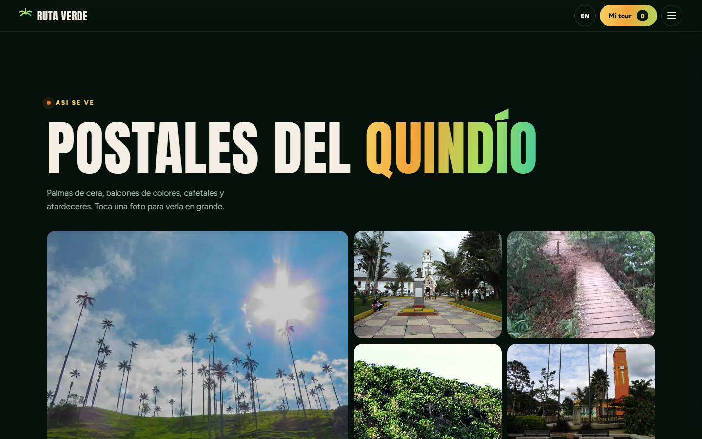 | 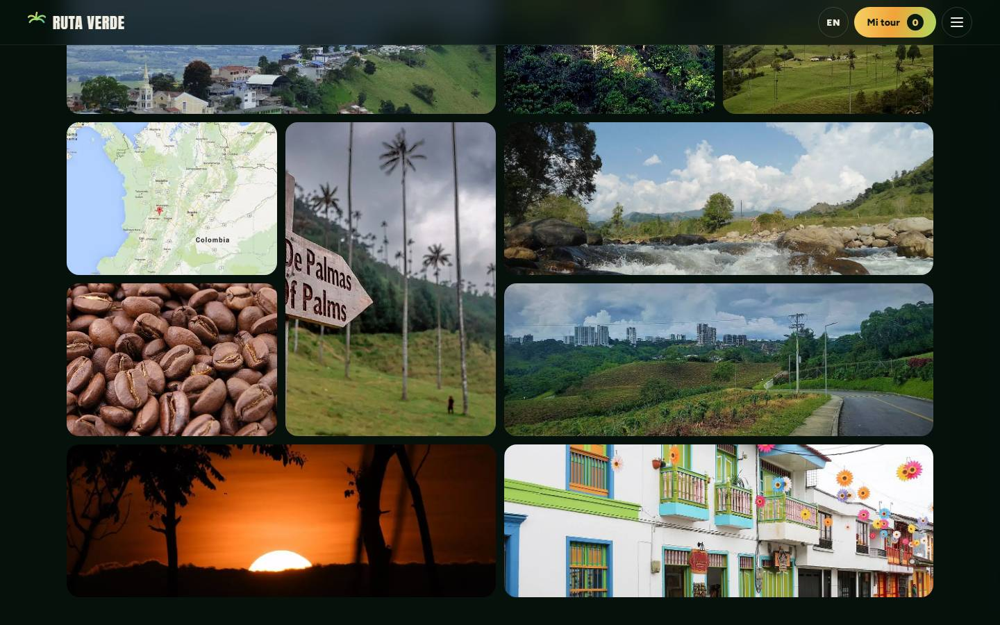 |

### Cuándo ir y cómo moverse

| Cuándo ir | Cómo moverse |
|---|---|
| 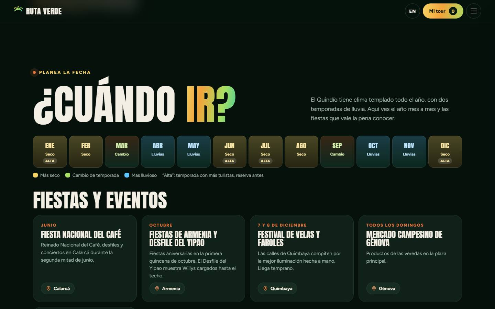 | 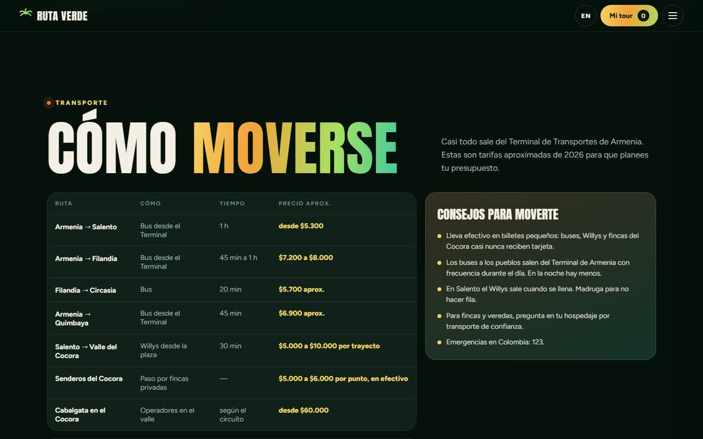 |

### Tu tour

El mapa sigue las carreteras y numera las paradas. Cada día muestra el pronóstico y cada traslado sus kilómetros.

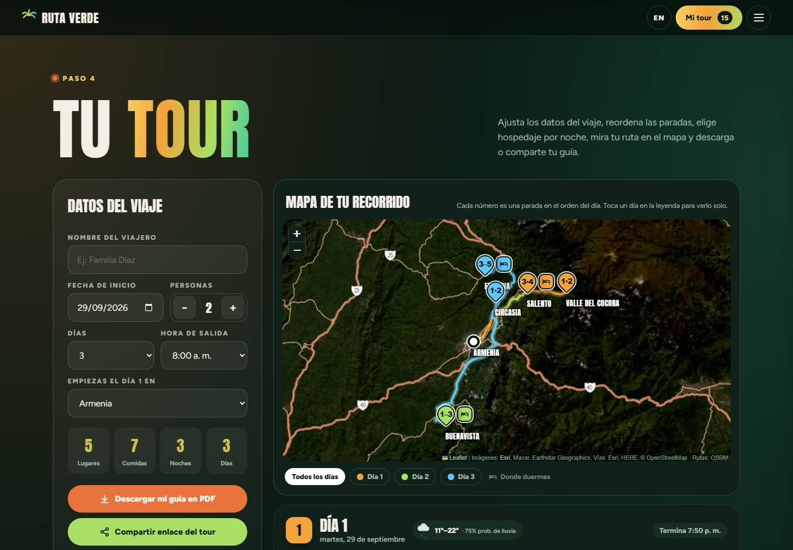

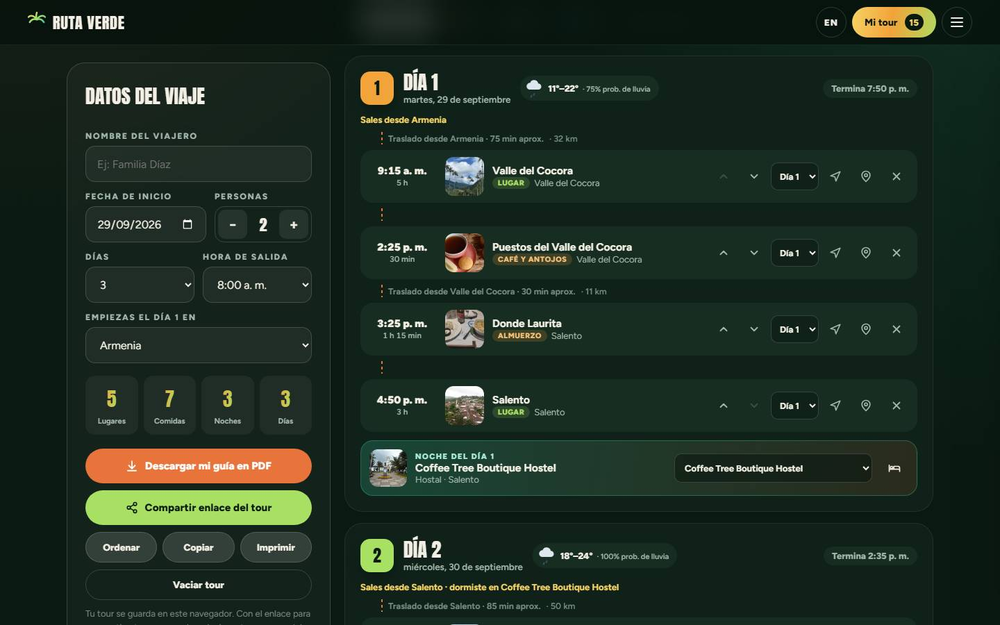

### En el celular

| Portada | Tu tour | Pueblos |
|---|---|---|
| 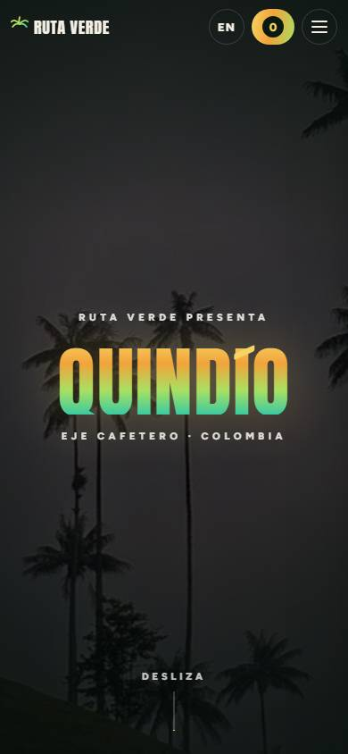 | 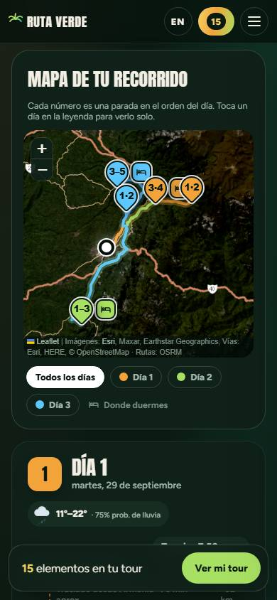 | 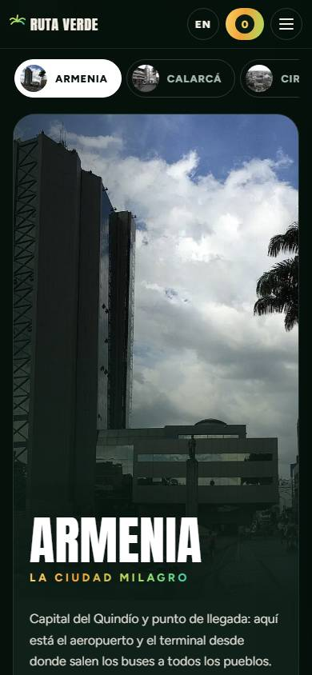 |

## Qué tiene la página

- **Portada animada**: al bajar, la palabra QUINDÍO crece y se desvanece y se abre la foto del Valle del Cocora.
- **El mapa**: los 12 pueblos y todos los lugares en un mapa satelital. Tocas un pueblo para ver su guía o un lugar para agregarlo a tu tour. Con los botones "Dónde comer" y "Dónde dormir" aparecen los restaurantes y hospedajes de los que tenemos la ubicación exacta.
- **Tours sugeridos**: un clic carga un tour completo (lugares, restaurantes y hospedaje por noche) que luego puedes cambiar.
- **Galerías de fotos**: cada lugar, restaurante y hotel tiene varias fotos; se ven en el panel de detalle y en pantalla completa.
- **Lugares**: tarjetas con cómo llegar, cuánto tiempo necesitas, consejos y el **clima en vivo**.
- **Dónde comer** y **dónde dormir**: restaurantes y hospedajes reales del Quindío. No hay precios, solo recomendaciones.
- **Pueblo por pueblo**: pestañas con una foto grande por pueblo. Son 12: Armenia, Circasia, Filandia, Salento, Montenegro, Quimbaya, Buenavista, Calarcá, Pijao, Génova, Córdoba y La Tebaida.
- **Postales**: galería de fotos que se abren en grande.
- **Cuándo ir**: calendario de temporadas y fiestas.
- **Cómo moverse**: rutas y tarifas de transporte entre pueblos.
- **Tu tour**: el recorrido organizado por días. El mapa sigue las carreteras reales, numera las paradas en orden, marca dónde duermes y deja ver un día a la vez. Cada traslado dice los kilómetros por carretera, y si el viaje es en los próximos 16 días, cada día muestra el pronóstico del clima.
- **Llevarte la guía**: copiar el texto, imprimir, descargar en PDF o compartir un enlace que abre el mismo tour en otro celular.
- **Sin internet**: la página publicada se guarda en el teléfono la primera vez que se abre. En el Cocora o en Pijao, sin señal, la guía y tu tour siguen abriendo.

Tu tour se guarda en el navegador: si cierras la página y vuelves, sigue ahí.

## Cómo verla en tu computador

No necesita instalar nada. Abre `index.html` con doble clic en el navegador. Los mapas, el clima y el PDF funcionan así.

El modo sin internet solo funciona con la página publicada (o servida con un servidor local), porque el navegador no lo permite en archivos abiertos con doble clic:

```bash
python -m http.server 8000
```

Y entra a http://localhost:8000 (en inglés: http://localhost:8000/?lang=en).

## Archivos del proyecto

| Archivo | Para qué sirve |
|---|---|
| `index.html` | La página. Carga todos los demás archivos. |
| `styles.css` | Colores, letras y diseño, ordenado por secciones. |
| `data.js` | Fotos, los primeros 7 pueblos, lugares, restaurantes, hospedajes y tours sugeridos. |
| `data2.js` | Los 5 pueblos nuevos, más lugares, calendario, tarifas de transporte y coordenadas de los pueblos. |
| `photos2.js` | Más fotos: galerías de cada lugar, platos típicos y entorno de cada pueblo, con sus créditos. Aquí se agregan fotos propias de un negocio. |
| `geo.js` | Ubicación exacta de los restaurantes y hospedajes que la tienen. |
| `routes.js` | Rutas por carretera entre pueblos: kilómetros, tiempo y trazado. |
| `i18n.js` | Textos de botones y títulos en español e inglés. |
| `en.js`, `en2.js` | Traducción al inglés del contenido de `data.js` y `data2.js`. |
| `core.js` | El núcleo: idioma, fotos, guardado del tour, enlace para compartir, horarios, traslados y pronóstico. |
| `maps.js` | Los dos mapas: el de la región y el de tu tour. |
| `ui.js` | Lo demás que se ve en pantalla: portada animada, tarjetas, filtros, pueblos, postales y armado del tour. |
| `pdf.js` | Copiar, imprimir y descargar el tour en PDF. |
| `sw.js` | Guarda la página en el teléfono para usarla sin internet. |
| `manifest.webmanifest` | Nombre e ícono si alguien instala la página en su celular. |
| `img/` | Fotos en formato WebP, cada una en dos tamaños: `-s` (pequeña) y `-l` (grande). También `og.jpg` (la imagen al compartir en redes) y los íconos. |
| `robots.txt`, `sitemap.xml` | Para que Google encuentre la página. |
| `PUBLICAR.md` | Cómo publicar, actualizar y aparecer en Google. |
| `docs/GUIA-DEL-CODIGO.md` | Explicación técnica del código. |

### Sobre las fotos de restaurantes y hoteles

Las fotos de la página tienen licencia libre (Wikimedia Commons), porque las de Google, Booking o Instagram tienen derechos de autor y no se pueden copiar. Casi ningún restaurante u hotel del Quindío tiene fotos libres, así que sus galerías muestran fotos del tipo de plato y del pueblo, con la nota "Foto ilustrativa". Cuando hay una foto del propio negocio, sale primero con la etiqueta **Foto real** (hoy: Café Jesús Martín). Cada ficha tiene el botón **Fotos y opiniones en Google**, que abre las fotos reales del sitio en Google Maps.

Para poner fotos reales de un negocio (tomadas por ti o enviadas por el negocio con su permiso), sigue las instrucciones al inicio de `photos2.js`.

Los archivos `.js` se cargan en este orden y el orden importa: `data.js`, `data2.js`, `photos2.js`, `geo.js`, `routes.js`, `i18n.js`, `en.js`, `en2.js`, `core.js`, `maps.js`, `ui.js`, `pdf.js`.

## Cómo actualizar la guía

- Para agregar o cambiar un restaurante u hospedaje de los primeros 7 pueblos, edita `data.js`.
- Para los pueblos nuevos, el calendario o las tarifas de transporte, edita `data2.js`.
- Para poner un restaurante u hospedaje en su sitio exacto del mapa, agrégalo en `geo.js`.
- Si agregas algo en español, agrega su traducción en `en2.js` con el mismo `id`. Si falta la traducción, la página muestra el texto en español.
- Para cambiar un botón o un título, edita `i18n.js` en los dos idiomas.
- Después de cualquier cambio, sube el número de versión como explica [PUBLICAR.md](PUBLICAR.md).

## Servicios externos

La página usa estos servicios gratuitos. Todos cargan solo cuando se necesitan:

- [Open-Meteo](https://open-meteo.com/): clima en vivo de cada lugar y pronóstico de los días del viaje.
- [Leaflet](https://leafletjs.com/) con la vista satelital y las vías de [Esri](https://www.esri.com/): los dos mapas. Funciona aunque abras la página con doble clic.
- [Google Fonts](https://fonts.google.com/): letras Anton y Figtree.
- [jsPDF](https://github.com/parallax/jsPDF): crear el PDF.

Las rutas por carretera (con [OSRM](https://project-osrm.org/)) y las ubicaciones exactas (con [Nominatim](https://nominatim.org/)) se calcularon una sola vez sobre datos de [OpenStreetMap](https://www.openstreetmap.org/copyright) y quedaron guardadas en `routes.js` y `geo.js`. La página no los consulta.

## Créditos de las fotos

Las fotos vienen de [Wikimedia Commons](https://commons.wikimedia.org/). Su licencia (CC BY-SA y similares) exige nombrar al autor: los créditos están al pie de la página y en `data.js` y `data2.js`. **No los quites.**

## Aviso

Los datos de restaurantes, hospedajes, horarios y transporte pueden cambiar. Verifica antes de viajar.
